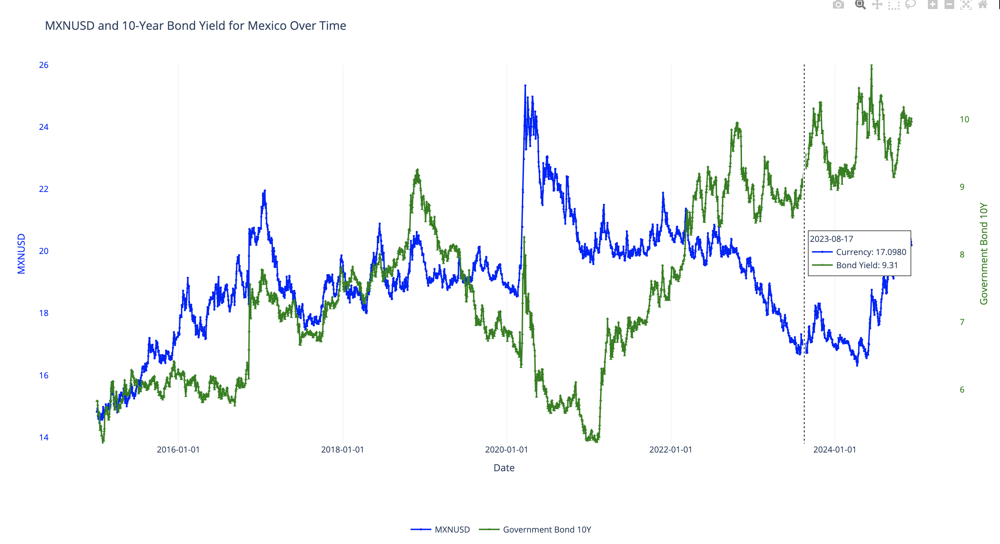

# Trading Economics
## Demo project 

This is a demo project, to showcase the use of API endpoints to generate graphs of relevant economic indicators 
for Mexico.

### How to Start and Use Application
Setup (assumes MacOS)

Before starting: you will need your own tradingeconomics API key to use.

1. Go to root folder in your terminal
2. Export your tradingeconomics API key: export apikey='your private key goes here'
3. Create virtual environment: python -m venv tradingeconomics_venv
4. Activate environment: source tradingeconomics_venv/bin/activate
5. Install dependencies: pip install -r requirements.txt 
6. Run: python main.py

Sample output of the graph you will see.

 

